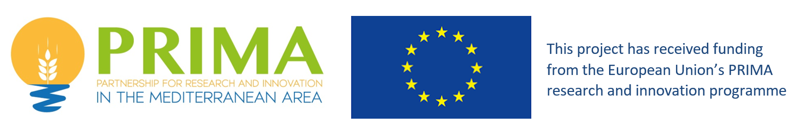
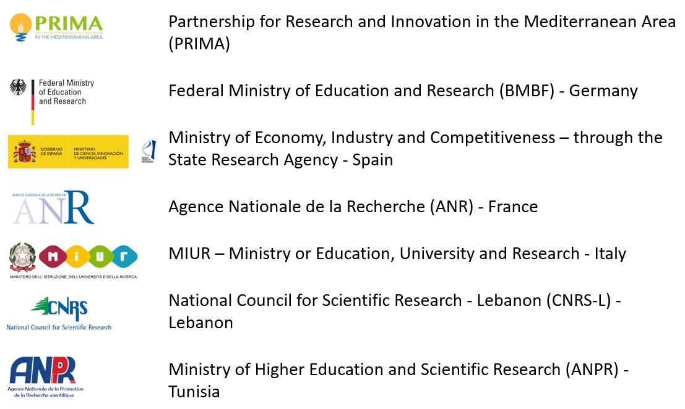

D4.4 Release of modelling tools: Lumped parameter modelling
================
Guillaume Cinkus, Naomi Mazzilli, Hervé Jourde and Zhao Chen
07/09/2021

# User Guide

## Description

Lumped parameter models were used as part of Deliverable D4.2 to model
time series of karst spring discharge. The models were developed within
KarstMod, which provides a platform for global modelling of the
precipitation-level-discharge relationship in karst catchments. The
models also benefited from the use of a snow routine during the
preprocessing of the data. The snow routine helped to simulate snow
accumulation and melt on the catchment, providing better and more
accurate simulation of the springs discharges. The use of the snow
routine function requires a little knowledge in R.

This repository contains the following elements:

-   KarstMod files for each KARMA test site
-   R script for performing the snow routine
-   This user guide, which provides the context and guidelines for the
    modelling

## Workflow

### Snow routine

The snow routine is detailed in the section 2.3 of the Deliverable D4.2.
The routine is inspired from the work of Chen et al. (2018), which
successfully simulated spring discharge of a mountainous karst system
heavily influenced by snow accumulation and melt. The workflow is:

1.  Get time series of (i) precipitation, (ii) temperature, and (iii)
    potential clear-sky solar radiation (if needed)
2.  Define subcatchment (if needed) then calculate their areas and their
    relative proportion to the whole catchment
3.  Apply the snow routine function for each subcatchment. We recommend
    to shift the temperature time series according to an appropriate
    temperature gradient scaling with altitude. The inputs for the snow
    routine function are:
    -   temperature vector (T,1)
    -   precipitation vector (T,1)
    -   potential clear-sky solar radiation vector (T,1)
    -   model parameters vector: temperature threshold, melt factor,
        refreezing factor, water holding capacity of snow and radiation
        coefficient (T,5)
4.  Apply the relative proportion of each subcatchment to their
    corresponding P time series (output of the snow routine)
5.  Sum up the P time series of each subcatchment

**If you work without solar radiation, radiation coefficient parameter
needs to be `0` and potential clear-sky solar radiation must be a vector
of `0` of the same length as temperature and precipitation time
series.**

### KarstMod

The KarstMod platform is detailed in the User manual. The main workflow
is:

1.  Prepare the input data
2.  Open the appropriate KARMA KarstMod file (if needed)
3.  Import the input data
4.  Define warm-up/calibration/validation periods
5.  Define Output directory
6.  Run calibration

You can modify the model parameters, the objective function, the number
of iterations, the maximum time, etc… If you want to save the new
modifications, just press `Save` and you will get a new KarstMod file.

## Resources

For more details about the KarstMod platform, please refer to the User
manual provided below.

For more details about the snow routine and KARMA models, please refer
to the Deliverable D4.2 provided below.

Download KarstMod: <https://sokarst.org/en/softwares-en/karstmod-en/>

Download KarstMod User manual:
<https://hal.archives-ouvertes.fr/hal-01832693>

Download Deliverable D4.2:
<http://karma-project.org/index.php/downloads/deliverables-publications>

## KARMA project

KARMA is implemetend under the umbrella of the Partnership for Research
and Innovation in the Mediterranean Area (PRIMA), which aims to develop
new R&I approaches to improve water availability and sustainable
agriculture production in a region heavily distressed by climate change,
urbanisation and population growth.

The PRIMA programme is an Art.185 initiative supported and funded under
Horizon 2020, the European Union’s Framework Programme for Reasearch and
Innovation.

The various project partners are each funded by their national funding
institution (see below).

<!-- -->

## References

Chen, Z., Hartmann, A., Wagener, T., Goldscheider, N., 2018. Dynamics of
water fluxes and storages in an Alpine karst catchment under current and
potential future climate conditions. Hydrology and Earth System Sciences
22, 3807–3823. <https://doi.org/10.5194/hess-22-3807-2018>
